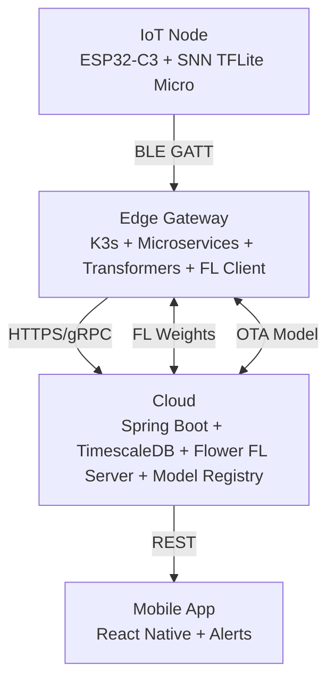
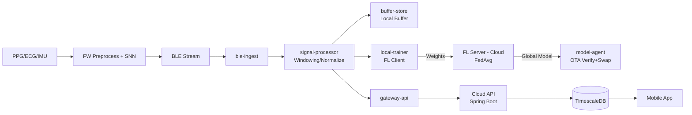
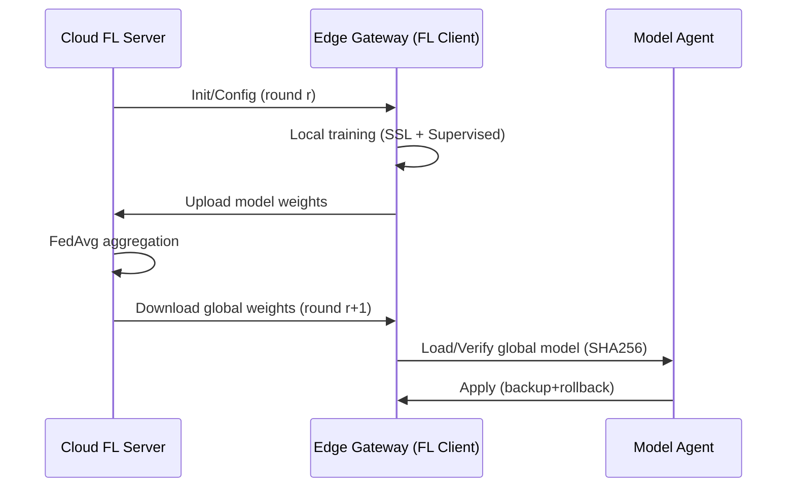
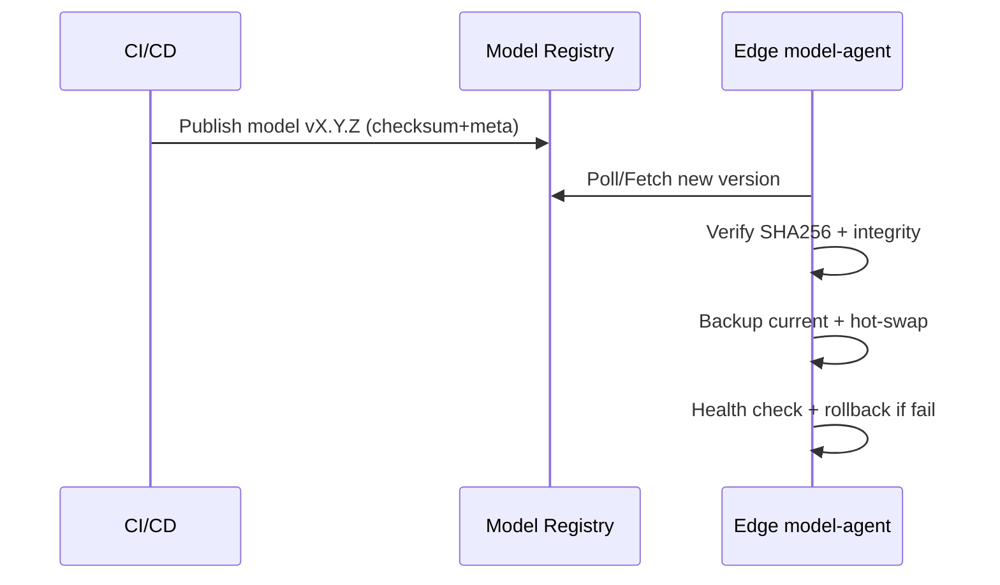

# Mermaid Diagrams

## 1. High-level Architecture

```mermaid
graph TB
  IoT[IoT Node\nESP32-C3 + SNN TFLite Micro] -->|BLE GATT| Edge[Edge Gateway\nK3s + Microservices + Transformers + FL Client]
  Edge -->|HTTPS/gRPC| Cloud[Cloud\nSpring Boot + TimescaleDB + Flower FL Server + Model Registry]
  Cloud -->|REST| Mobile[Mobile App\nReact Native + Alerts]
  Edge <-->|FL Weights| Cloud
  Cloud <-->|OTA Model| Edge
```

## 2. Data Pipeline

```mermaid
flowchart LR
  S[PPG/ECG/IMU] --> F[FW Preprocess + SNN]
  F --> B[BLE Stream] --> I[ble-ingest]
  I --> SP[signal-processor\nWindowing/Normalize]
  SP --> BS[buffer-store\nLocal Buffer]
  SP --> LT[local-trainer\nFL Client]
  SP --> GA[gateway-api]
  LT -->|Weights| FS[FL Server - Cloud\nFedAvg]
  FS -->|Global Model| MA[model-agent\nOTA Verify+Swap]
  GA --> API[Cloud API\nSpring Boot]
  API --> TSDB[(TimescaleDB)]
  TSDB --> MOB[Mobile App]
```

## 3. Federated Learning Flow

```mermaid
sequenceDiagram
  participant FL_Server as Cloud FL Server
  participant Edge as Edge Gateway (FL Client)
  participant ModelAgent as Model Agent
  FL_Server->>Edge: Init/Config (round r)
  Edge->>Edge: Local training (SSL + Supervised)
  Edge->>FL_Server: Upload model weights
  FL_Server->>FL_Server: FedAvg aggregation
  FL_Server->>Edge: Download global weights (round r+1)
  Edge->>ModelAgent: Load/Verify global model (SHA256)
  ModelAgent->>Edge: Apply (backup+rollback)
```

## 4. OTA Update Flow

```mermaid
sequenceDiagram
  participant CI as CI/CD
  participant Registry as Model Registry
  participant Agent as Edge model-agent
  CI->>Registry: Publish model vX.Y.Z (checksum+meta)
  Agent->>Registry: Poll/Fetch new version
  Agent->>Agent: Verify SHA256 + integrity
  Agent->>Agent: Backup current + hot-swap
  Agent->>Agent: Health check + rollback if fail
```
